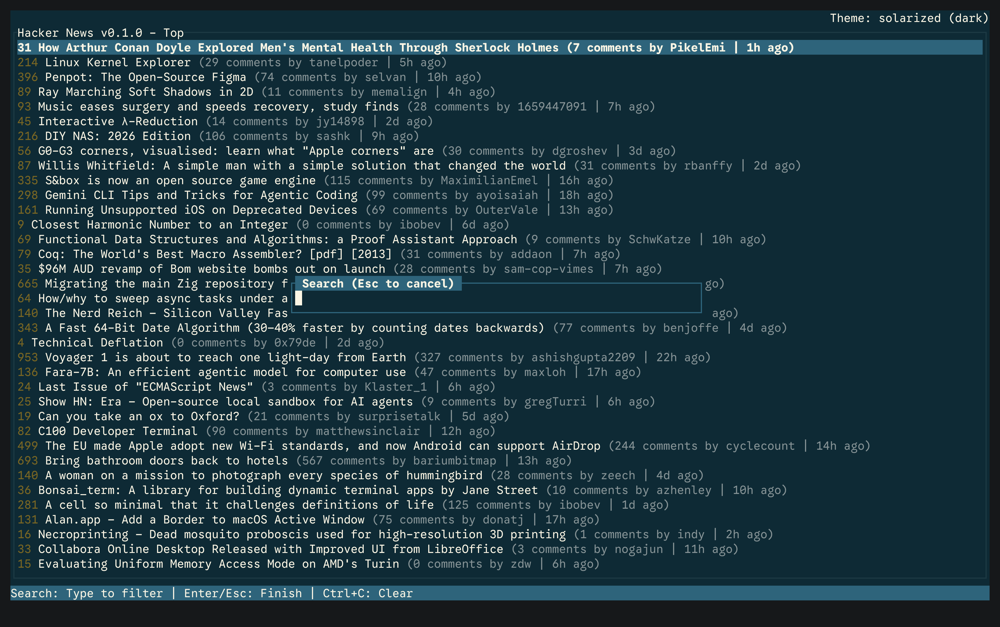
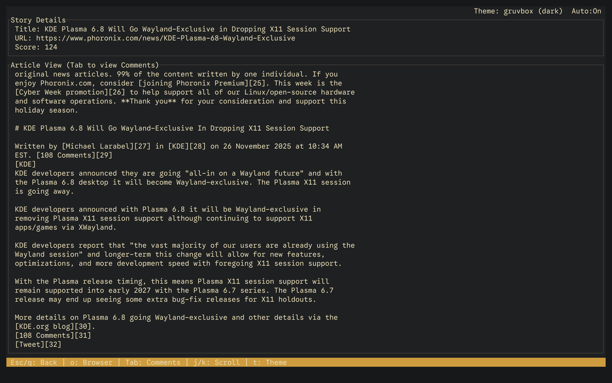
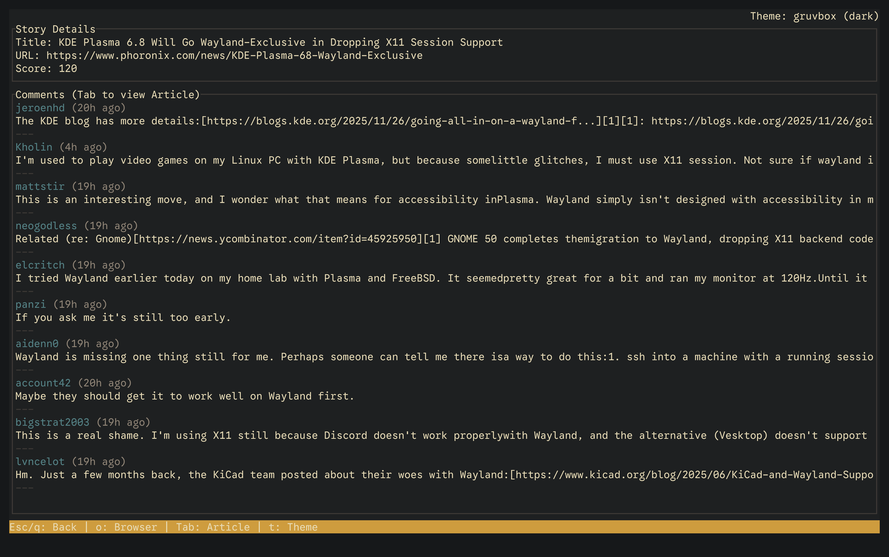

# TUI Hacker News App (ratatui)

A terminal-based Hacker News client written in Rust using `ratatui`. This project provides a fast, keyboard-driven TUI for browsing Hacker News stories, viewing story details and comments, and reading articles inside an embedded terminal view.

This README documents the current TUI-focused implementation and recent UI improvements (theme location, version placement, and article-view behavior).

## Architecture

This is a single-binary Rust TUI app structured for clarity between public API code, services, and UI rendering.

- Core TUI rendering: `ratatui`
- Async tasks & channels: `tokio`
- HTTP API client: `reqwest` (blocking client is used in the API service to simplify testing)
- Theming: JSON theme files parsed into a `TuiTheme` used by `ratatui` styles
- Configuration: RON (`config.ron`) with `AppConfig`

### High-level project structure

```
src/
├── api/              # Hacker News API service and types (fetching stories, comments, articles)
├── config.rs         # Configuration loading and management (AppConfig)
├── internal/         # Internal implementation modules and models
│   ├── models.rs     # Data models (Story, Comment)
│   └── ...           # internal helpers
├── lib.rs            # Library entry point (public module exports)
├── main.rs           # Application entry point (init, run)
├── tui.rs            # Terminal init/restore helpers (enter/leave alternate screen)
└── utils/            # Utility functions (datetime, html extraction, theme loader)
```

## Features

- Browse Hacker News categories: Best, Top, New, Ask, Show, Job
- Keyboard-driven navigation (vi-like keys)
- Story details and comments view
- Inline article viewing with **rich text support**
  - Syntax highlighting for code blocks
  - Table rendering
  - Image placeholders
- **In-memory caching with TTL** — reduces API calls and improves performance
  - Story cache (5 min TTL)
  - Comment cache (5 min TTL)  
  - Article cache (15 min TTL)
- Theme loading from JSON files; theme preview in top-right header
- Version shown in the list title to make builds traceable from the UI
- Search/filter stories in the list
- **Enhanced story list** with metadata display
  - Domain/source extraction (e.g., "github.com")
  - Two-line layout for better readability
  - Relative age indicators (e.g., "2h ago", "3d ago")
  - Bookmark indicators (★) for saved stories
- **Bookmarks/Favorites system** (v0.5.0)
  - Save stories for later reading with `b` key
  - View all bookmarks with `B` key
  - Persistent storage: platform-dependent (resolved via `dirs::config_dir()`):
    - Linux / Unix (and when `XDG_CONFIG_HOME` is set): `~/.config/tui-hn-app/bookmarks.json`
    - macOS: `~/Library/Application Support/tui-hn-app/bookmarks.json`
    - To force a specific location on Linux/Unix, set `XDG_CONFIG_HOME` before launching the app. Example:
      `export XDG_CONFIG_HOME="$HOME/.config"` then run the app so bookmarks will be stored under `$XDG_CONFIG_HOME/tui-hn-app/bookmarks.json`
  - Import/export functionality
- **History Tracking** (v0.5.1)
  - Tracks last 50 viewed stories
  - View history with `H` key
  - Clear history with `X` key
  - Persistent storage in `history.json`
- **Enhanced Search** (v0.5.2)
  - Regex search support toggle with `Ctrl+R` or `F3`
  - Search modes: Title only, Comments only, or Both (cycle with `Ctrl+M` or `F2`)
  - Search history navigation with `↑`/`↓` arrows
  - Persistent search history (last 20 searches)
  - Live regex error feedback
- **Sorting Options** (v0.5.3)
  - Sort by Score, Comments, or Time
  - Toggle Ascending/Descending order
- **Key Binding Customization** (v0.6.0)
  - Customize keybindings via `config.ron`
  - Global and per-view mode keybindings
  - Context-aware key resolution
- Incremental loading with "Load More" and "Load All" behaviors
- **Comment threading** with visual hierarchy
  - Indented nested comments
  - Tree-like structure with visual guides (└─, │)
  - Collapse/expand support (up to 100 comments loaded)
- Comment pagination with smooth line-by-line scrolling
- Keyboard shortcuts help (`?` key)

## Screenshots

(These are illustrative — your terminal size and theme will affect appearance.)

| List View  | Article View | Comments View |
|:---:|:---:|:---:|
|   |  |  |
| Hacker News Category List | Article content for a selected story | Comments for the selected story |

Note: These screenshots were taken with version `v0.4.2`. Subsequent UI enhancements were made after that release, so the current app appearance may differ from the images shown here.

## Configuration

The app reads configuration from `config.ron` (searched in the working directory and next to the executable). A `config.example.ron` is provided — copy it to `config.ron` and edit as needed.

Important config keys:
- `theme_name` — preferred theme name.
- `theme_file` — path to themes directory or specific theme JSON.
- `auto_switch_dark_to_light` — automatic theme switching based on terminal.
- `ghost_term_name` — terminal name override for theme switching.
- `keybindings` — custom key mappings (optional, see `config.example.ron` for examples).

Example (abbreviated):
```ron
(
    // Minimal configuration — only keys consumed by the application code.
    // Preferred theme name to apply (must match a theme defined in your theme files)
    // Examples: "Flexoki Light", "Flexoki Dark", "Solarized Dark"
    theme_name: "Gruvbox Dark",

    // Optional: path to a theme file or themes directory (defaults to "./themes")
    theme_file: "./themes",

    // When true, automatically switch a configured Dark theme to its Light variant
    // on terminals other than the configured ghost_term_name. Set to false to disable this behavior.
    auto_switch_dark_to_light: true,

    // The TERM value that should be treated as the special "ghost" terminal
    // where explicit Dark/Light variants in `theme_name` are honored verbatim.
    // Defaults to "xterm-ghostty".
    ghost_term_name: "xterm-ghostty",

    // Optional: Custom keybindings (uncomment and customize as needed)
    // keybindings: (
    //     global: {
    //         "j": NavigateDown,
    //         "k": NavigateUp,
    //     },
    //     list: {
    //         "q": Quit,
    //     },
    // ),
)
```

## Usage

Run locally from the project root:

- Development run:
  - `cargo run`
- Recommended local workflow (TDD-friendly):
  - `task fmt`     — runs `cargo fmt`
  - `task clippy`  — runs `cargo clippy`
  - `task build`   — runs format + clippy then `cargo build --release`
  - `task run`     — runs the release binary

If you prefer direct cargo commands:
- Format: `cargo fmt`
- Lint: `cargo clippy --all-targets --all-features`
- Run: `cargo run`

## Keyboard Shortcuts

| Key | Action |
|-----|--------|
| `1`-`6` | Switch story category (Top, New, Best, Ask, Show, Job) |
| `j` / `↓` | Move down in list / Scroll article down |
| `k` / `↑` | Move up in list / Scroll article up |
| `Enter` | View selected story |
| `Tab` | Toggle between Article and Comments view |
| `o` | Open story URL in browser |
| `n` | Load more comments (in Comments view) |
| `/` | Enter search mode (filter stories) |
| `Q` | Clear search filter |
| `m` | Load more stories (next 20) |
| `A` | Load all remaining stories |
| `b` | Toggle bookmark on selected story |
| `B` | View bookmarked stories |
| `H` | View history |
| `X` | Clear history (in History view) |
| `t` | Cycle through themes |
| `S` | Sort by Score |
| `C` | Sort by Comments |
| `T` | Sort by Time |
| `O` | Toggle sort order (Asc/Desc) |
| `g` | Toggle auto-switch dark to light |
| `Esc` / `q` | Go back / Quit |

## Behavior notes / UX details

- Title location: The list title now includes the app version (from `CARGO_PKG_VERSION`), making it easy to confirm which build is running.
- Theme location: Theme name and variant appear right-aligned in the top bar.
- Article fetch logic: Selecting a new story clears any previously fetched article content; toggling to Article view triggers a fresh fetch for the active story. This avoids showing stale article content when switching selection.

## Theming

- Drop JSON theme files into `./themes`. The app discovers themes and will list available variants (dark/light).
- You can cycle themes with `t`. The active theme name is shown top-right.

## Performance

### In-Memory Caching

The app implements an in-memory cache with TTL (Time To Live) to reduce API calls and improve responsiveness:

**Cache Types:**
- **Story Cache**: 5-minute TTL
  - Caches individual story metadata (title, score, author, etc.)
  - Reduces repeated API calls when navigating back to previously viewed stories
  
- **Comment Cache**: 5-minute TTL
  - Caches comment content
  - Faster loading when revisiting story discussions
  
- **Article Cache**: 15-minute TTL
  - Caches fetched article content
  - Articles are less frequently updated, so longer TTL is appropriate

**How it works:**
1. **First request**: Fetches from Hacker News API → stores in cache
2. **Subsequent requests** (within TTL): Returns from cache instantly
3. **After expiration**: Automatically fetches fresh data from API

**Benefits:**
- ⚡ **Instant loading** for recently viewed content
- 🌐 **Reduced network traffic** and API load
- 💾 **Lower bandwidth usage** on metered connections
- 🔄 **Automatic refresh** ensures data doesn't go stale

The cache is thread-safe and transparent to users — no configuration required.

## Testing

- Unit tests exist for API helpers and utilities (run with `cargo test`).
- Tests are written to avoid network dependency where possible (mockito is used for `ApiService` tests).

## Contributing

We follow a TDD-first and tidy-first workflow:
1. Write the smallest failing test for the behavior (Red).
2. Implement the minimal code to make the test pass (Green).
3. Refactor and tidy without changing behavior, run tests (Tidy First).
4. Keep commits small and focused; run `cargo fmt` and `cargo clippy` before committing.

See `AGENTS.md` in the repo for more detail on the development discipline and preferred commands.

## Troubleshooting

- If the terminal UI looks off, ensure your terminal emulator supports true color and uses a sufficient font size/width.
- If the article view appears empty, check your network connectivity — the app fetches article content from the URL and converts HTML to text.
- For theme problems, validate theme JSON syntax and ensure theme names match the `theme_name` value in `config.ron`.

---
